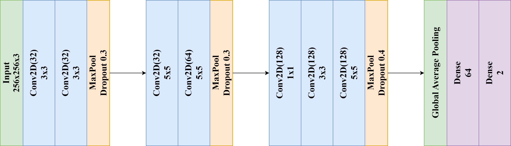
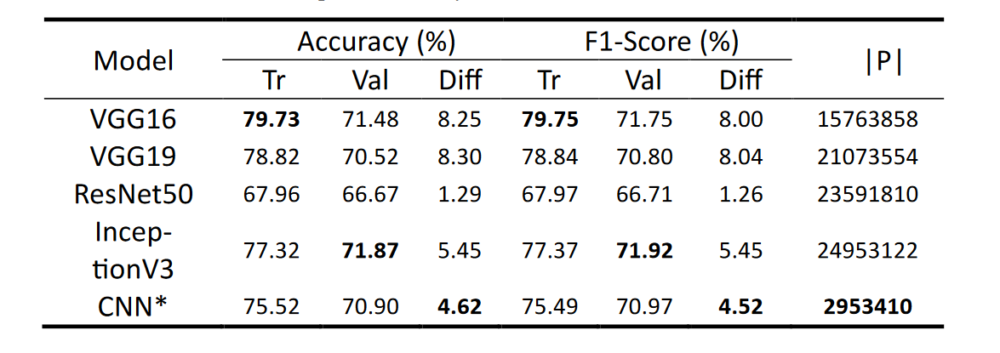

# Cartoon Moderation
# Deep Learning in Cartoon Moderation: Distinguishing Child-Friendly Content with CNN Architectures

In this research, we have developed a Convolutional Neural Network (CNN) model to
categorize different types of content in cartoons. The model is adept at differentiating
between regular scenes and those depicting violence or adultery. Our approach to
creating this model was comprehensive and methodical, encompassing careful data
preparation, rigorous model training, and thorough validation procedures. The entire
process, from data acquisition to the final validation, is systematically outlined in our
system architecture diagram, providing a clear visualization of the steps involved in
developing this specialized CNN model. This structured methodology ensures that the
model is accurate in its content categorization and robust and reliable for practical
applications in content moderation.

Our custom CNN model architecture uniquely amalgamates VGG16's robust feature
extraction capabilities with the computational efficiency of Inception models.
Tailored specifically for discerning content in cartoons that might be unsuitable for
younger audiences, this architecture leverages the combined strengths of VGG16's
depth and Inception's breadth. The result is a comprehensive set of features capable of 
accurately classifying various content types, thereby contributing to safer media consumption 
for children.

# Comparative Performance Analysis

• VGG16 and VGG19 showed high training (T) accuracy and F1 scores but
exhibited a significant drop in performance during validation (V), indicating
a possible overfitting tendency.
• ResNet50 demonstrated the smallest difference (D) between training and validation metrics, suggesting better generalization capabilities, though its overall performance was lower compared to the VGG models.
• InceptionV3 balanced performance and generalization moderately well, with
a mid-range difference between training and validation results.

Despite having significantly fewer parameters (|P|), our CNN* achieved competitive
accuracy and F1 scores, particularly in the validation phase. This indicates a more
efficient use of parameters and a balanced generalization ability.

# Video Processing and Result

